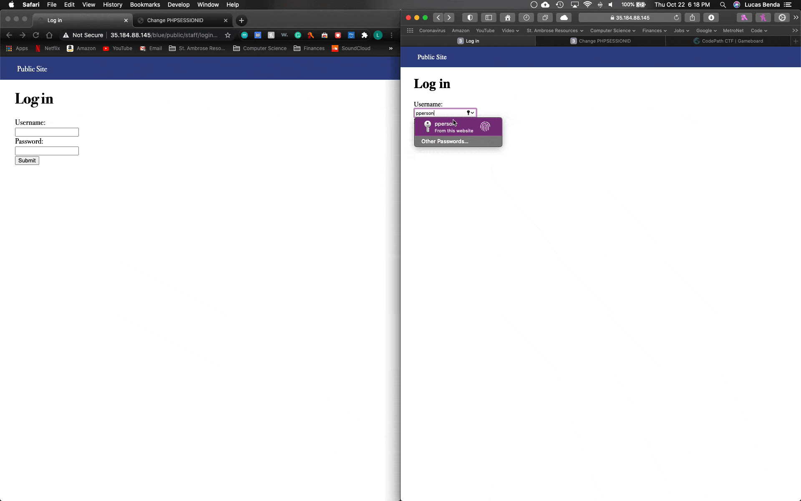
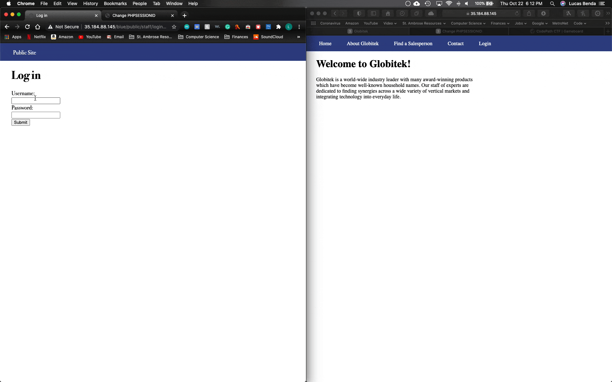
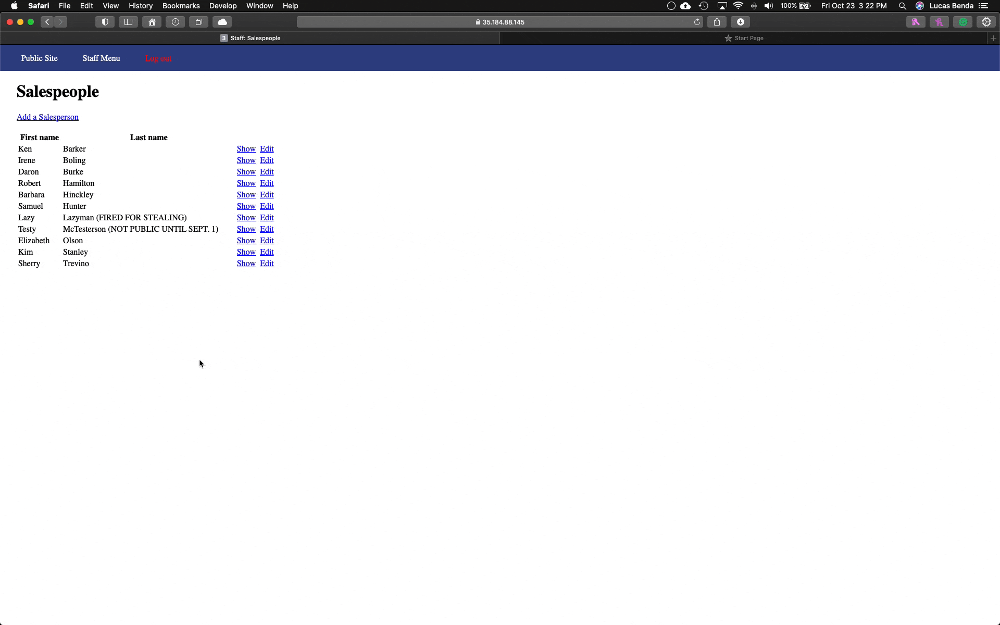

# Project 8 - Pentesting Live Targets

Time spent: **7** hours spent in total

> Objective: Identify vulnerabilities in three different versions of the Globitek website: blue, green, and red.

The six possible exploits are:

* Username Enumeration
* Insecure Direct Object Reference (IDOR)
* SQL Injection (SQLi)
* Cross-Site Scripting (XSS)
* Cross-Site Request Forgery (CSRF)
* Session Hijacking/Fixation

Each color is vulnerable to only 2 of the 6 possible exploits. First discover which color has the specific vulnerability, then write a short description of how to exploit it, and finally demonstrate it using screenshots compiled into a GIF.

## Blue

Vulnerability #1:**Session Hijacking/Fixation**

Description:
  **Session Hijacking**
  1. Open up the log in page and the hacktools/change_session_id.php script on two seperate browsers
  2. Log in on one browser (victim - Safari on right) then open a new tab and use the hacktools/change_session_id.php script to get the session ID.
  3. Copy the session ID.
  4. On the other browser (attacker - Chrome on left), go to the hacktools/change_session_id.php script and change the session ID to match the one that was just copied.
  5. Now, go to the log in page on the attacker browser and you will be logged in to the same account as the one on the victim browser without having to enter a username or password since it has the same session ID as the victim.
  

  **Session Fixation**
  1. Open up the log in page and the hacktools/change_session_id.php script on two seperate browsers
  2. Log in on one browser (victim - Safari on right) then open a new tab and use the hacktools/change_session_id.php script to get the session ID.
  3. Copy the session ID.
  4. On the other browser (attacker - Chrome on left), go to the hacktools/change_session_id.php script and change the session ID to match the one that was just copied.
  5. Now, go to the log in page on the attacker browser and you will be logged in to the same account as the one on the victim browser without having to enter a username or password since it has the same session ID as the victim.

Vulnerability #2: **SQL Injection (SQLi)**

Description:

## Green

Vulnerability #1: __________________

Description:

Vulnerability #2: __________________

Description:

## Red

Vulnerability #1: __________________

Description:

Vulnerability #2: __________________

Description:

## Notes

Describe any challenges encountered while doing the work
