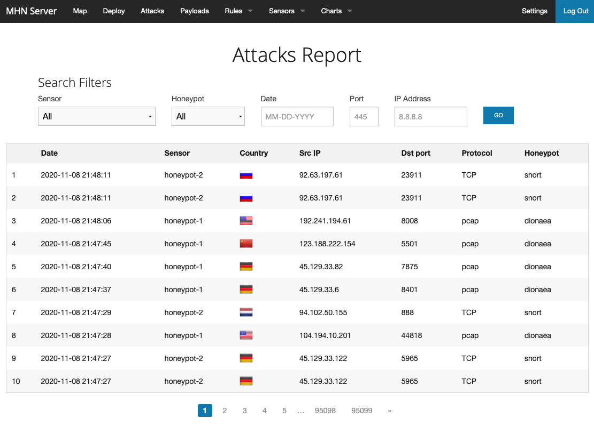

# Honeypot Assignment

**Time spent:** **5** hours spent in total

**Objective:** Create a honeynet using MHN-Admin. Present your findings as if you were requested to give a brief report of the current state of Internet security. Assume that your audience is a current employer who is questioning why the company should allocate anymore resources to the IT security team.

### MHN-Admin Deployment (Required)

**Summary:** 
**How did you deploy it? Did you use GCP, AWS, Azure, Vagrant, VirtualBox, etc.?**
For this assignment, I deployed my honeypots using Google Cloud Platform (GCP). I started by ccreating a GCP account, downloading and installing the GCP SDK to my local machine, and initialized it. I then created the MHN Admin VM via GCP. The VM has an internet-facing IP and is accessible via SSH. I then ran the following commands to establish the firewall. The first command lists the current default firewall rules. The subsequent multi-line commands will enable the required inbound ports for MHN Admin.
```
gcloud compute firewall-rules list

gcloud compute firewall-rules create http \
    --allow tcp:80 \
    --description="Allow HTTP from Anywhere" \
    --direction ingress \
    --target-tags="mhn-admin"

gcloud compute firewall-rules create honeymap \
    --allow tcp:3000 \
    --description="Allow HoneyMap Feature from Anywhere" \
    --direction ingress \
    --target-tags="mhn-admin"

gcloud compute firewall-rules create hpfeeds \
    --allow tcp:10000 \
    --description="Allow HPFeeds from Anywhere" \
    --direction ingress \
    --target-tags="mhn-admin"
```
Then, I created the VM, named "mhn-admin":
```
gcloud compute instances create "mhn-admin" \
    --machine-type "n1-standard-1" \
    --subnet "default" \
    --maintenance-policy "MIGRATE" \
    --tags "mhn-admin" \
    --image "ubuntu-minimal-1804-bionic-v20200703a" \
    --image-project "ubuntu-os-cloud" \
    --boot-disk-size "10" \
    --boot-disk-type "pd-standard" \
    --boot-disk-device-name "mhn-admin"
```
This produces an output with internal and external IP addresses. Be sure to note the external IP.
```
NAME        ZONE           MACHINE_TYPE   PREEMPTIBLE  INTERNAL_IP  EXTERNAL_IP      STATUS
mhn-admin  us-central1-f  n1-standard-1                10.128.0.2   35.255.202.10    RUNNING
```

Lastly, establish SSH access to the VM via:
```
gcloud compute ssh mhn-admin
```
The Ubuntu welcome message and shell prompt will then appear.

*Note: Many commands shown in the gif produced errors because I have already deployed the MHN-Admin*


### Dionaea Honeypot Deployment (Required)

**Summary:** 
**Briefly in your own words, what does dionaea do?**
Dionaea over HTTP is a honeypot used to capture attack payloads and malware.  Its goal is to obtain a copy of the malware exploiting vulnerabilities exposed by services offered on a network.

*Note: The first command shown in the gif produced an error because I had already created the firewall rule to allow incoming TCP and UDP traffic on all ports for honeypot sensors*


This gif show how to install the honeypot application


### Database Backup (Required) 

**Summary:** 
**What is the RDBMS that MHN-Admin uses?**
A RDBMS (Relational Database Management System) is a type of database whose structure allows users to identify and access data in relation to another piece of data in the database. The RDBMS that MHN-Admin uses is found on the Attacks Report page.  


**What information does the exported JSON file record?** 
The exported JSON file records all of the data that is collected in the attacks report of the MHN admin. The file displays the ID, protocol, timestamp, source IP, source port, destination port, identifier, and honeypot type for each captured attack. Example entry: ```{"_id":{"$oid":"5f9f22f6616a1e555b4dcda2"},"protocol":"pcap","hpfeed_id":{"$oid":"5f9f22f5616a1e555b4dcda1"},"timestamp":{"$date":"2020-11-01T21:04:53.191Z"},"source_ip":"45.129.33.9","source_port":59961,"destination_port":11124,"identifier":"ce766616-1c85-11eb-9027-42010a800002","honeypot":"dionaea"}```

*Be sure to upload session.json directly to this GitHub repo/branch in order to get full credit.*


### Deploying Additional Honeypot(s) (Optional)

#### Snort Honeypot

**Summary:** 
**What does this honeypot simulate and do for a security researcher?**
Snort is an open source intrusion prevention system capable of real-time traffic analysis, alerting, blocking, and packet logging. It utilizes a combination of protocol analysis and pattern matching in order to detect a anomalies, misuse and attacks. Snort is capable of detecting and responding in real-time, sending alerts, performing session sniping, logging packets, or dropping sessions/packets when deployed in-line. Snort has three primary functional modes: packet sniffer (like tcpdump), packet logger (useful for network traffic debugging, etc), or as a full blown network intrusion detection and prevention system.


#### Conpot Honeypot

**Summary:** 
**What does this honeypot simulate and do for a security researcher?**
Conpot is a low interactive server side Industrial Control Systems honeypot designed to be easy to deploy, modify and extend. The goal of this honeypot is to collect intelligence about the motives and methods of adversaries targeting industrial control systems.


### Malware Capture and Identification (Optional)

#### X Malware

**Summary:** How did you find it? Which honeypot captured it? What does each malware do?

MD5 Hash: *Run `md5sum` on the file and record the hash here.*

SHA1 Hash: *Run `sha1sum` on the file and record the hash here.*


## Notes

**Describe any challenges encountered while doing the assignment.**

I was unable to figure out how to identify the malware attacks nor get the file hash of the malware sample. There was little/no guidance for this step.

