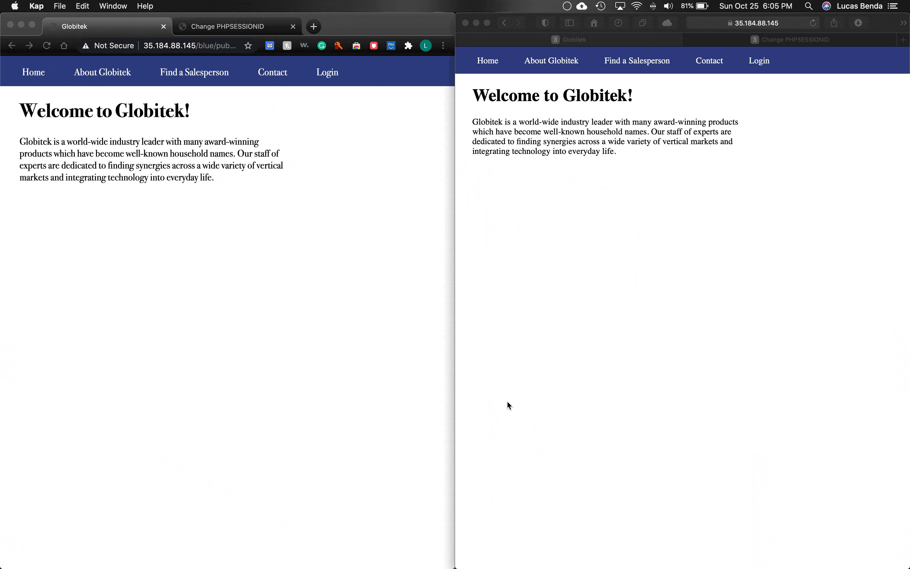
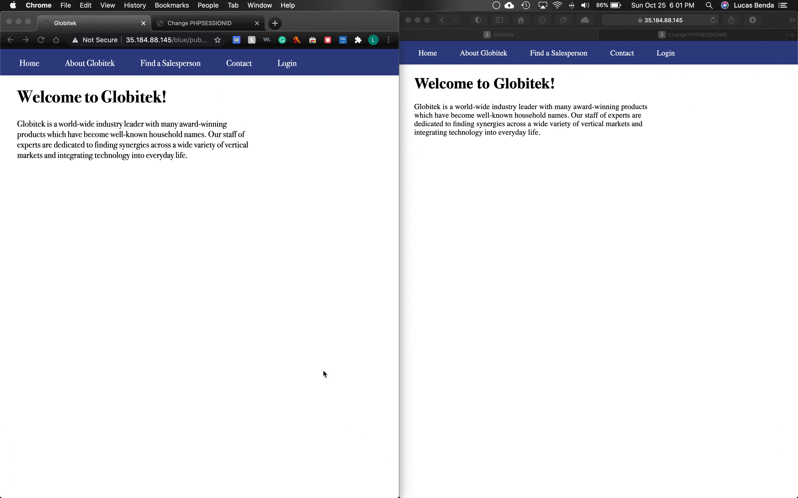
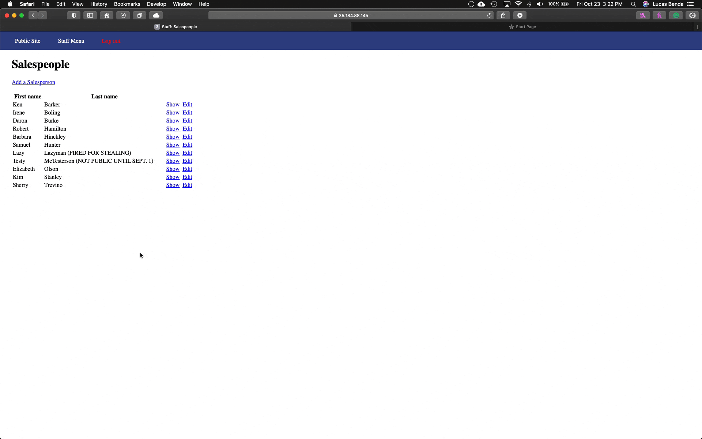
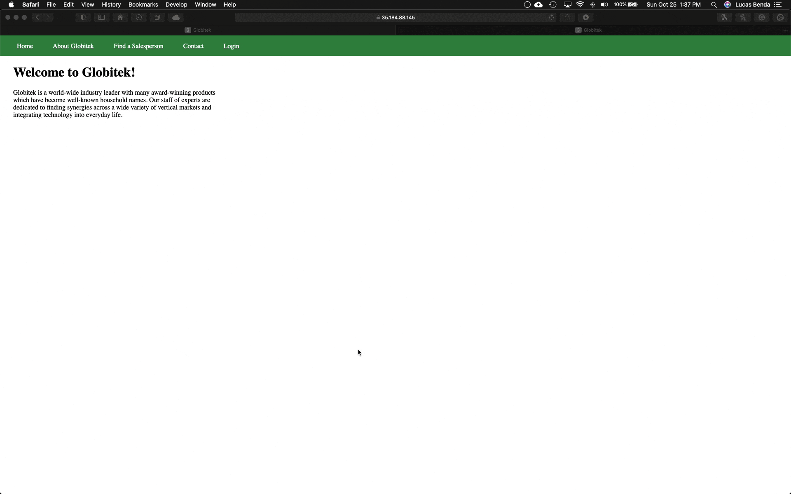
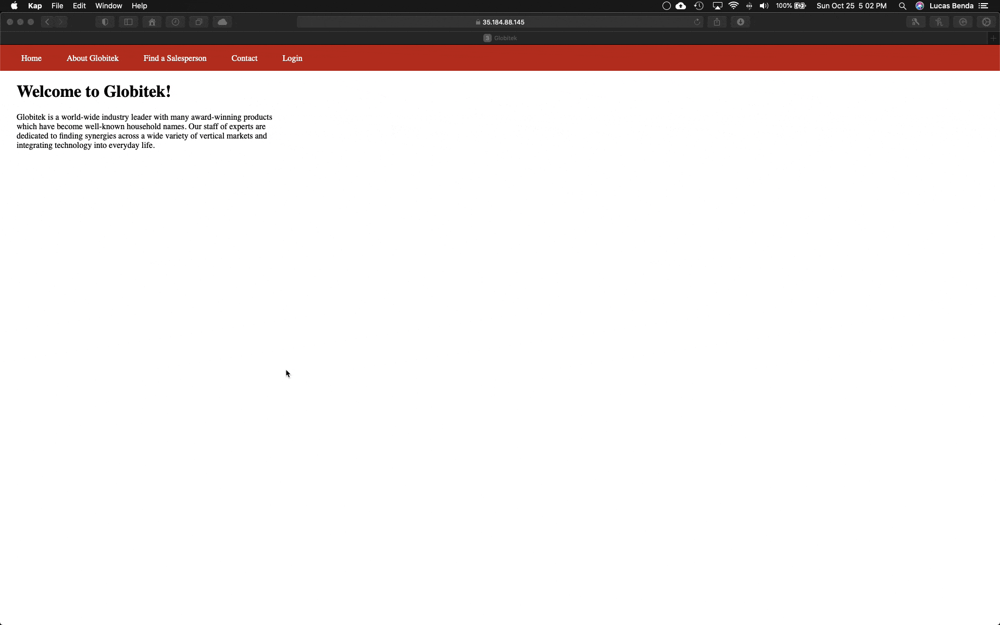
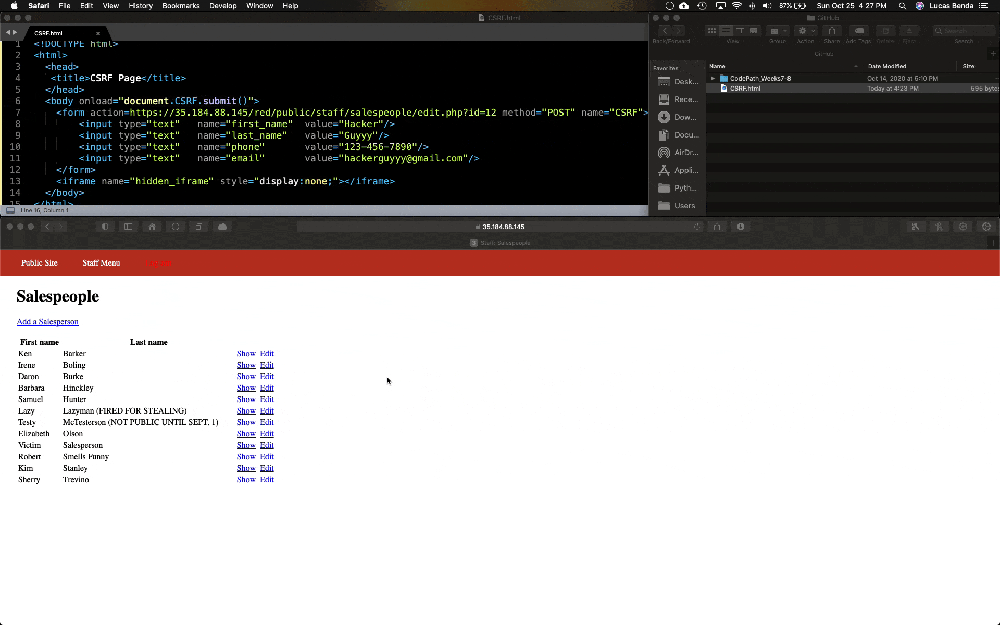

# Project 8 - Pentesting Live Targets

Time spent: **7** hours spent in total

> Objective: Identify vulnerabilities in three different versions of the Globitek website: blue, green, and red.

The six possible exploits are:

* Username Enumeration
* Insecure Direct Object Reference (IDOR)
* SQL Injection (SQLi)
* Cross-Site Scripting (XSS)
* Cross-Site Request Forgery (CSRF)
* Session Hijacking/Fixation

Each color is vulnerable to only 2 of the 6 possible exploits. First discover which color has the specific vulnerability, then write a short description of how to exploit it, and finally demonstrate it using screenshots compiled into a GIF.

## Blue

Vulnerability #1:**Session Hijacking/Fixation**

Description:

  **Session Hijacking**
  1. Open up the log in page and the hacktools/change_session_id.php script on two seperate browsers
  2. Log in on one browser (victim - Safari on right) then open a new tab and use the hacktools/change_session_id.php script to get the session ID.
  3. Copy the session ID.
  4. On the other browser (attacker - Chrome on left), go to the hacktools/change_session_id.php script and change the session ID to match the one that was just copied.
  5. Now, go to the log in page on the attacker browser and you will be logged in to the same account as the one on the victim browser without having to enter a username or password since it has the same session ID as the victim.
  


  **Session Fixation**
  1. Open up the log in page and the hacktools/change_session_id.php script on two seperate browsers
  2. Open the hacktools/change_session_id.php script on the attacker browser (Chrome - left) and get a session ID. Copy the session ID.
  3. On the other browser (victim - Safari on right), go to the hacktools/change_session_id.php script and change the session ID to match the one that was just copied.
  4. Log in on the victim browser.
  5. The attacker can now log in on the attacker browser.


Vulnerability #2: **SQL Injection (SQLi)**

Description:
  1. Log into the site and navigate to the Salespeople page
  2. Select 'Show' for any salesperson
  3. Add ```' OR SLEEP(3)=0--'``` to the end of the url. The sleep() function allows you to specify the number of seconds it takes for the page to load (3 and 7 seconds are shown in the GIF)


## Green

Vulnerability #1: **Cross-Site Scripting (XSS)**

Description:
  1. Go to the contact tab and fill out the form with a fake name and email and the following inside the feedback section: ```<script>alert('[Name] found the XSS');</script>```
  2. Then log in and proceed to the 'Feedback' section
  3. Here the alert will pop up, indicating that the attack was successful.



Vulnerability #2: **Username Enumeration**

Description:
  1. When attempting to log in on the Green site with a existing username, the error message is presented in bold. Also, the html class is labeled **"failure"**.
  2. When attempting to log in on the Green site with a nonexisting username, the error message is presented in plaintext. The html class for this error is labeled **"failed"**.
  3. The other two sites do not have these discrepancies.
  4. The mistake that the developer of the Green site made was using different classes for a username that does exist and a username that does not exist. He/she also forgot to bold the error message's text for a nonexisting username. This vulnerability allows an attacker to determine whether or not a username exists.


## Red

Vulnerability #1: **Insecure Direct Object Reference (IDOR)**

Description:



Vulnerability #2: **Cross-Site Request Forgery (CSRF)**

Description:




## Notes

**Describe any challenges encountered while doing the work**
It was difficult to figure out which attacks would work on each site. This was the most time consuming part of the assignment.  Nevertheless, I acknowledge that this is a major aspect of hacking and what makes the assignment far closer to real-world encounters. 
