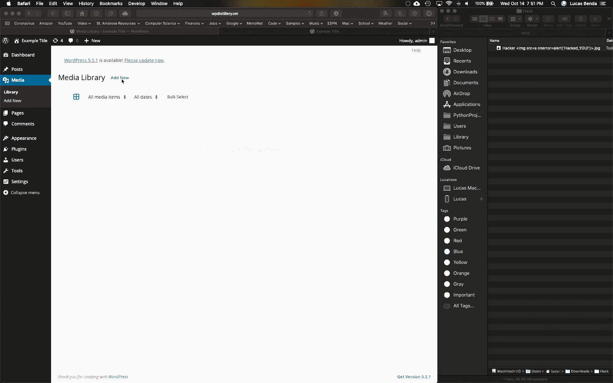
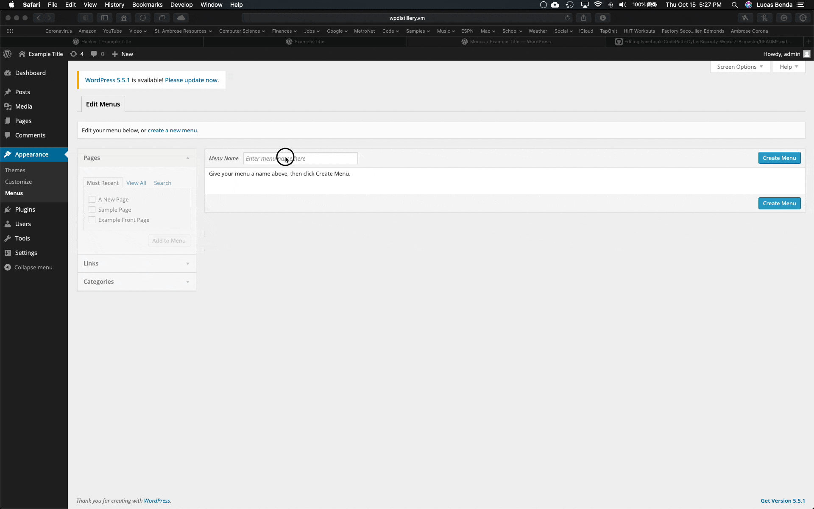
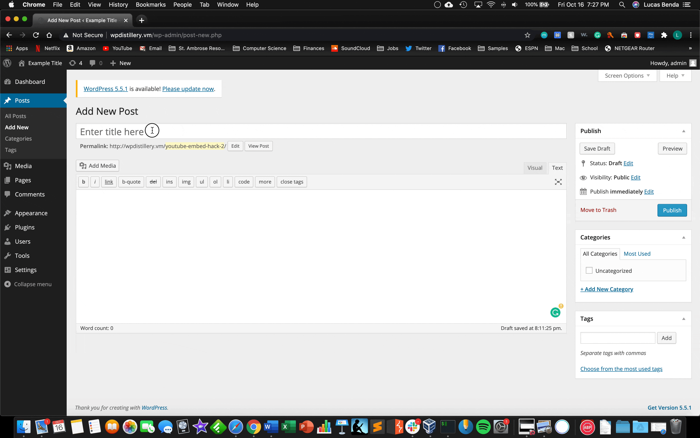

# Project 7 - WordPress Pentesting

Time spent: **6** hours spent in total

> Objective: Find, analyze, recreate, and document **1. XSS via Media File's Metadata, 2. , 3.** affecting an old version of WordPress

## Pentesting Report

1. (Required) Vulnerability Name or ID **Authenticated Cross-Site Scripting (XSS) via Media File Metadata**
  - [x] Summary: 
    - Vulnerability types:**XSS**
    - Tested in version: **4.1.1**
    - Fixed in version: **4.1.16**
  - [x] GIF Walkthrough: 
   
  
  - [x] Steps to recreate:
  
    **1. Logged into word press as administrator**<br>
    **2. Choose an image to upload and save to local machine**<br>
    **3. Name the image file:** ```yourNameHere .jpg```<br>
    **4. Navigate to 'Media' tab**<br>
    **5. Click on 'add new'**<br>
    **6. Browse for image/drag into the upload section**<br>
    **7. Click on the image and select 'Edit more details'**<br>
    **8. Make sure the title is the name you gave the image file in step 3, with the** `````` **tag**<br>
    **9. Then select 'View Attachment Page'**<br>
    **10.When vieiwin the page, the alert is displayed, thus the exploit succeeds.**<br>
  - [ ] Affected source code:
    - [Link 1](https://core.trac.wordpress.org/browser/tags/version/src/source_file.php)
       **N/A**
    
2. (Required) Vulnerability Name or ID **Nav Menu Title Cross-Site Scripting (XSS)**
  - [x] Summary: 
    - Vulnerability types:**XSS**
    - Tested in version:**4.1.1**
    - Fixed in version: **4.2.4**
  - [x] GIF Walkthrough: 
  
  
  - [x] Steps to recreate: **Cross-site scripting (XSS) vulnerability in the refreshAdvancedAccessibilityOfItem function in wp-admin/js/nav-menu.js in WordPress before 4.2.4 allows remote attackers to inject arbitrary web script or HTML via an accessibility-helper title.**<br>
    **1. Logged into word press as administrator**<br>
    **2. Navigate to the 'Appearance' tab**<br>
    **3. Select 'Menus'**<br>
    **4. Give the new menu a name (example: Main Menu) and press Enter or click 'Create Menu'**<br>
    **5. Then select a page to add to the menu and click 'Add to Menu'**<br>
    **6. Click the drop down arrow on the page bar**<br>
    **7. Replace the Navigation Label with the following code:** ```<script>alert(document.cookie);</script>```<br>
    **8. Click 'Save Menu'**<br>
    **9. A popup will appear indicting a successful exploit**<br> 
    
  - [x] Affected source code:
    - [Link 1](https://atimmer.github.io/wordpress-jsdoc/-_enqueues_lib_nav-menu.js.html)
    
3. (Required) Vulnerability Name or ID **Authenticated Stored Cross-Site Scripting (XSS) in YouTube URL Embeds**
  - [x] Summary: 
    - Vulnerability types: **XSS**
    - Tested in version:**4.1.1**
    - Fixed in version: **4.1.16**
  - [x] GIF Walkthrough: 
  
  
  - [x] Steps to recreate:<br>
    **1. Logged into word press as administrator**<br>
    **2. Navigate to the 'Posts' tab**<br>
    **3. Select 'Add New'**<br>
    **4. Give the new post a name**<br>
    **5. Then paste the following embed fake YouTube link:** ```[embed src="http://youtube.com/embed/12345\x3csvg onload=alert('Hacked...Again!')\x3e"][/embed]```<br>NOTE: 12345 and the alert message can be customized<br>
    **6. Click 'Preview'**<br>
    **7. An alert will pop up on the page indicating a successful exploit**<br>
  
  - [x] Affected source code:
    - [Link 1](https://github.com/WordPress/WordPress/commit/419c8d97ce8df7d5004ee0b566bc5e095f0a6ca8)
    - [CVE](https://cve.mitre.org/cgi-bin/cvename.cgi?name=CVE-2017-6817)
    
4. (Optional) Vulnerability Name or ID
  - [ ] Summary: 
    - Vulnerability types:
    - Tested in version:
    - Fixed in version: 
  - [ ] GIF Walkthrough: 
  - [ ] Steps to recreate: 
  - [ ] Affected source code:
    - [Link 1](https://core.trac.wordpress.org/browser/tags/version/src/source_file.php)
5. (Optional) Vulnerability Name or ID
  - [ ] Summary: 
    - Vulnerability types:
    - Tested in version:
    - Fixed in version: 
  - [ ] GIF Walkthrough: 
  - [ ] Steps to recreate: 
  - [ ] Affected source code:
    - [Link 1](https://core.trac.wordpress.org/browser/tags/version/src/source_file.php) 

## Assets

List any additional assets, such as scripts or files
**N/A**

## Resources

- [WordPress Source Browser](https://core.trac.wordpress.org/browser/)
- [WordPress Developer Reference](https://developer.wordpress.org/reference/)

GIFs created with [Kap](https://getkap.co).

## Notes

Describe any challenges encountered while doing the work

## License

    Copyright [yyyy] [name of copyright owner]

    Licensed under the Apache License, Version 2.0 (the "License");
    you may not use this file except in compliance with the License.
    You may obtain a copy of the License at

        http://www.apache.org/licenses/LICENSE-2.0

    Unless required by applicable law or agreed to in writing, software
    distributed under the License is distributed on an "AS IS" BASIS,
    WITHOUT WARRANTIES OR CONDITIONS OF ANY KIND, either express or implied.
    See the License for the specific language governing permissions and
    limitations under the License.
